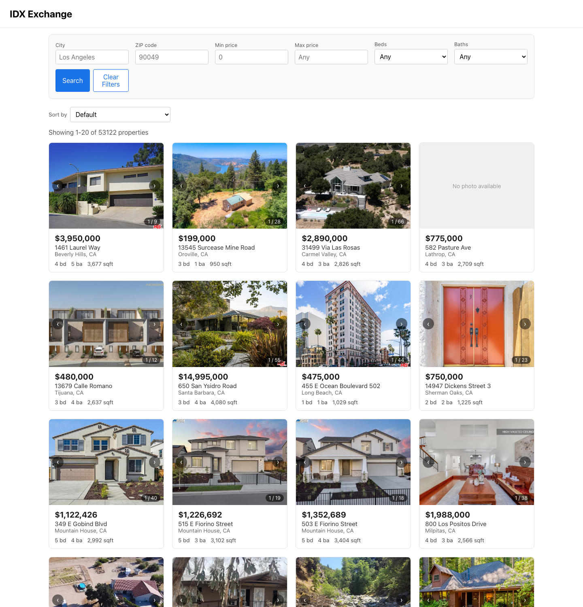
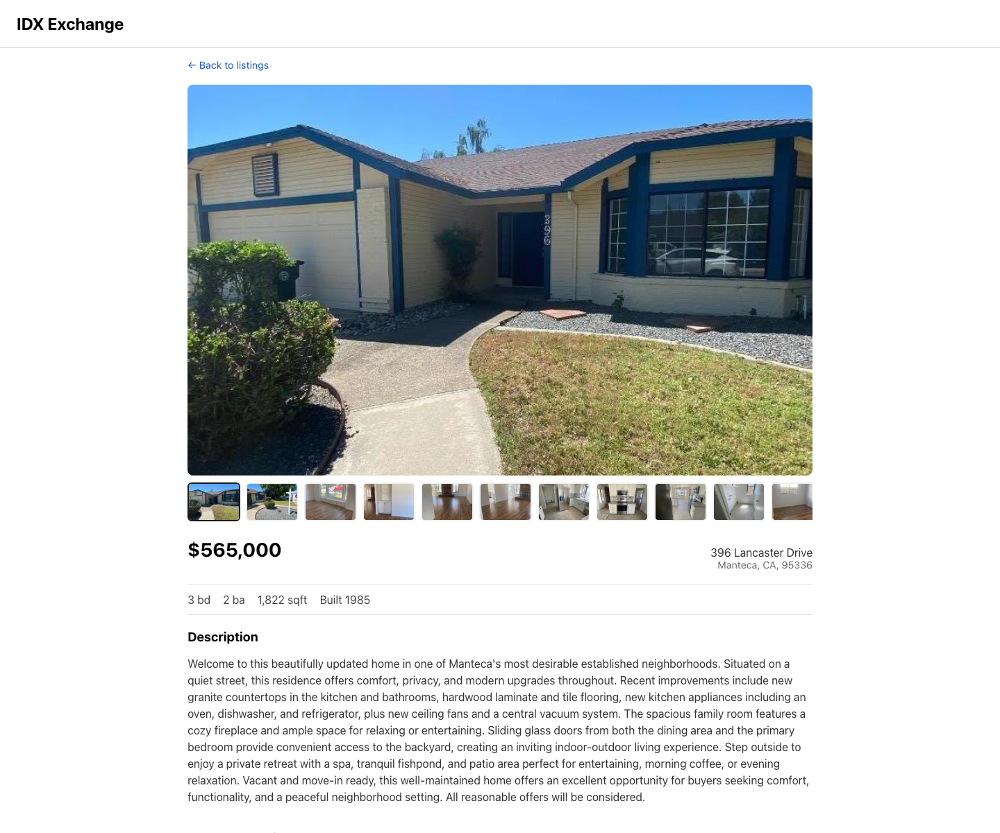

# IDX Exchange

A property search application built on a real MLS (RETS) data feed. It serves
53,000+ California listings with filtering, sorting, pagination, photo
galleries, maps, and open house schedules.



<details>
<summary>Property detail page</summary>



</details>

---

## Table of contents

- [Tech stack](#tech-stack)
- [Architecture](#architecture)
- [Local setup](#local-setup)
- [API reference](#api-reference)
- [Database schema](#database-schema)
- [Testing](#testing)
- [Known issues and future improvements](#known-issues-and-future-improvements)

---

## Tech stack

| Layer | Technology | Version |
| --- | --- | --- |
| Runtime | Node.js | 24.x (18+ works) |
| Database | MySQL (Docker `mysql:8`) | 8.x |
| Backend | Express | 4.22 |
| DB driver | mysql2 (promise API, pooled) | 3.9 |
| Frontend | React | 19.2 |
| Routing | React Router | 6.30 |
| Build | Create React App (react-scripts) | 5.0.1 |
| Backend tests | Jest + Supertest | 30.x / 7.x |
| Frontend tests | Jest + React Testing Library | via react-scripts |
| Maps | Google Maps Embed API | — |

---

## Architecture

```
Browser (React SPA, :3000)
   |
   |  fetch("/api/...")  -- CRA dev server proxies to :5000
   v
Express API (:5000)
   |
   |  pooled mysql2 queries
   v
MySQL 8 in Docker (:3306, database `rets`)
```

Three layers, each with a single responsibility:

- **MySQL** holds the two raw RETS dumps as imported. No ETL step — the API
  reads the vendor column names directly (`L_SystemPrice`, `LM_Dec_3`, …), so
  a re-import never requires a migration.
- **Express** owns validation and query building. Every user-supplied value is
  bound as a placeholder; the one value that cannot be bound (the `ORDER BY`
  column) is checked against a whitelist instead. The API is stateless.
- **React** owns presentation and URL state. Filters, sort, and page number all
  live in the query string, so any view is linkable and survives a refresh.

### Repository layout

```
backend/
  server.js              Express app, CORS, request logging, /api/health
  db/pool.js             mysql2 connection pool (single shared instance)
  db/indexes.sql         Index definitions for the search/sort columns
  routes/properties.js   All three property endpoints + validation
  tests/                 Jest + Supertest suites, database mocked
frontend/src/
  api/client.js          Thin fetch wrapper; turns non-2xx into thrown Errors
  hooks/                 usePropertySearch, usePropertyDetail -- data fetching
  pages/                 ListingsPage, PropertyDetailPage
  components/            Presentational; no data fetching of their own
  utils/                 Pure functions: pagination math, photo/date parsing
docs/
  weekly-notes.md        Week-by-week build log and debugging write-ups
```

The split that matters: **hooks fetch, components render, utils compute.** Pure
logic (the pagination window, `L_Photos` parsing, UTC date formatting) lives in
`utils/` precisely so it can be unit-tested without rendering anything.

---

## Local setup

From a fresh machine, in order.

### 1. Prerequisites

- [Docker Desktop](https://www.docker.com/products/docker-desktop/) — running
- Node.js 18 or newer (`node -v`)
- The two MLS dumps, `rets_property.sql` and `rets_openhouse.sql`, downloaded
  into the repository root. They total ~640 MB and are **not** in git; fetch
  them from the internship FileZilla share.

### 2. Clone

```bash
git clone <repository-url>
cd IDXExchange2026Summer
```

### 3. Start MySQL and import the data

```bash
docker run \
  --name idx-mysql-local \
  -e MYSQL_ROOT_PASSWORD=password \
  -e MYSQL_DATABASE=rets \
  -p 3306:3306 \
  -d \
  mysql:8

# Wait for the server to accept connections (a few seconds on first boot)
until docker exec idx-mysql-local mysqladmin ping -uroot -ppassword --silent; do sleep 2; done

# The property dump is ~630 MB and takes several minutes
docker exec -i idx-mysql-local mysql -uroot -ppassword rets < rets_property.sql
docker exec -i idx-mysql-local mysql -uroot -ppassword rets < rets_openhouse.sql
```

On later sessions the container already exists — start it with
`docker start idx-mysql-local` rather than re-running `docker run`.

### 4. Add the indexes

The dumps arrive indexed on a few columns (`L_ListingID`, `L_City`, `L_Zip`)
but not on the price, beds, baths, sqft, or date columns the search and sort
use — without these, every such query is a full 53k-row scan plus a filesort.

```bash
docker exec -i idx-mysql-local mysql -uroot -ppassword rets < backend/db/indexes.sql
```

### 5. Configure and start the backend

```bash
cd backend
cp .env.example .env     # defaults match the docker run above
npm install
npm run dev              # nodemon, http://127.0.0.1:5000
```

`.env` values:

| Variable | Default | Notes |
| --- | --- | --- |
| `PORT` | `5000` | Must match the `proxy` in `frontend/package.json` |
| `HOST` | `127.0.0.1` | |
| `DB_HOST` / `DB_PORT` | `127.0.0.1` / `3306` | The Docker port mapping |
| `DB_USER` / `DB_PASSWORD` | `root` / — | Set to the `MYSQL_ROOT_PASSWORD` used above |
| `DB_NAME` | `rets` | |
| `DB_CONNECTION_LIMIT` | `10` | Pool size |

Verify: `curl http://127.0.0.1:5000/api/health` → `{"status":"ok","database":"connected"}`

### 6. Configure and start the frontend

In a second terminal:

```bash
cd frontend
cp .env.example .env     # optional: add a Google Maps key
npm install
npm start                # http://localhost:3000
```

Without `REACT_APP_GOOGLE_MAPS_API_KEY`, everything works except the detail
page map, which shows an explanatory placeholder instead. To enable it, create
a key in the Google Cloud console with the **Maps Embed API** enabled.

CRA's `proxy` setting forwards `/api/*` to port 5000 in development, so the
frontend calls same-origin paths and no CORS configuration is needed locally.

### Troubleshooting

| Symptom | Cause |
| --- | --- |
| `database: "disconnected"` on `/api/health` | Container stopped — `docker start idx-mysql-local` |
| Listings load but every search is slow | Step 4 was skipped; the indexes are missing |
| `ECONNREFUSED 127.0.0.1:5000` in the browser | The backend isn't running, or `PORT` doesn't match the CRA proxy |
| `Unknown database 'rets'` | The container was created without `-e MYSQL_DATABASE=rets` |

---

## API reference

Base URL: `http://127.0.0.1:5000`. All responses are JSON. Errors use
`{ "error": "..." }`, with an extra `details` array of every validation failure
on a 400 so one round trip reports all of them.

### `GET /api/health`

Liveness check that also verifies the database connection.

```bash
curl http://127.0.0.1:5000/api/health
```

```json
{ "status": "ok", "database": "connected" }
```

Returns `500` with `{"status":"error","database":"disconnected"}` if the pool
cannot reach MySQL.

---

### `GET /api/properties`

Paginated, filterable, sortable listing search.

**Query parameters** — all optional:

| Parameter | Type | Default | Notes |
| --- | --- | --- | --- |
| `city` | string | — | Case- and whitespace-insensitive exact match |
| `zipcode` | string | — | Exact match, trimmed |
| `minPrice` | number ≥ 0 | — | Inclusive |
| `maxPrice` | number ≥ 0 | — | Inclusive; must be ≥ `minPrice` |
| `beds` | number ≥ 0 | — | **Minimum**, not exact (`3` returns 3+) |
| `baths` | number ≥ 0 | — | **Minimum**, not exact |
| `sortBy` | enum | — | `L_SystemPrice`, `ListingContractDate`, `LM_Int2_3`, `L_Keyword2` |
| `sortOrder` | `asc`\|`desc` | `asc` | Only meaningful with `sortBy` |
| `limit` | integer 1–100 | `20` | |
| `offset` | integer ≥ 0 | `0` | |

`sortBy` takes real column names rather than friendly aliases because it is
interpolated into the `ORDER BY` clause (column names cannot be bound as
placeholders) — the whitelist is the injection boundary.

**Example request**

```bash
curl "http://127.0.0.1:5000/api/properties?city=Beverly%20Hills&minPrice=1000000&beds=3&sortBy=L_SystemPrice&sortOrder=desc&limit=2"
```

**Example response** (`200`)

```json
{
  "total": 233,
  "limit": 2,
  "offset": 0,
  "results": [
    {
      "L_ListingID": "1118422731",
      "L_Address": "1461 Laurel Way",
      "L_City": "Beverly Hills",
      "L_State": "CA",
      "L_Zip": "90210",
      "L_SystemPrice": 3950000,
      "L_Keyword2": 4,
      "LM_Dec_3": "5.0",
      "LM_Int2_3": 3677,
      "L_Photos": "[\"https://api.cotality.com/trestle/Media/...\"]",
      "LMD_MP_Latitude": "34.099106000000000",
      "LMD_MP_Longitude": "-118.418132000000000",
      "YearBuilt": 1973,
      "LotSizeAcres": "0.4261"
    }
  ]
}
```

`total` is the count of rows matching the filters, ignoring `limit`/`offset` —
it is what the frontend divides by `limit` to get the page count.

**Example error** (`400`)

```bash
curl "http://127.0.0.1:5000/api/properties?limit=500&minPrice=900000&maxPrice=1000"
```

```json
{
  "error": "Invalid query parameters",
  "details": [
    "limit must be <= 100",
    "minPrice must not be greater than maxPrice"
  ]
}
```

| Status | When |
| --- | --- |
| `200` | Success (an empty `results` array is still a 200) |
| `400` | Any parameter fails validation |
| `500` | Database error |

---

### `GET /api/properties/:id`

Full detail for one listing, keyed on `L_ListingID`. Returns every column
(`SELECT *`, 126 of them) — the detail page uses fields the list endpoint
omits, such as `L_Remarks`.

**Example request**

```bash
curl http://127.0.0.1:5000/api/properties/1077426281
```

**Example response** (`200`) — abridged

```json
{
  "id": 13587,
  "L_ListingID": "1077426281",
  "L_Address": "396 Lancaster Drive",
  "L_City": "Manteca",
  "L_State": "CA",
  "L_Zip": "95336",
  "L_SystemPrice": 565000,
  "L_Keyword2": 3,
  "LM_Dec_3": "2.0",
  "LM_Int2_3": 1822,
  "YearBuilt": 1985,
  "L_Remarks": "Welcome to this beautifully updated home ...",
  "L_Photos": "[\"https://api.cotality.com/trestle/Media/...\"]"
}
```

| Status | When | Body |
| --- | --- | --- |
| `200` | Found | The listing object |
| `400` | `id` isn't 1–64 alphanumeric/`-`/`_` characters | `{"error":"id must be alphanumeric and 64 characters or fewer"}` |
| `404` | No such listing | `{"error":"No property found with id 000000000"}` |
| `500` | Database error | `{"error":"Failed to fetch property"}` |

---

### `GET /api/properties/:id/openhouses`

Open house schedule for one listing, chronological by date then start time.
Returns a bare array rather than an envelope — there is no pagination here.

**Example request**

```bash
curl http://127.0.0.1:5000/api/properties/1174572339/openhouses
```

**Example response** (`200`)

```json
[
  {
    "L_ListingID": "1174572339",
    "OpenHouseDate": "2026-06-20T07:00:00.000Z",
    "OH_StartTime": "14:00:00",
    "OH_EndTime": "16:00:00",
    "all_data": "{\"OpenHouseType\":\"Public\",\"OpenHouseRemarks\":null, ...}"
  }
]
```

A listing with no scheduled open houses returns `200` with `[]` — the property
exists, it simply has nothing scheduled. `404` is reserved for a listing that
doesn't exist at all, which the handler checks before querying open houses.

`all_data` above is abridged — it is a JSON *string* of roughly 45 vendor
fields that were never given real columns, `OpenHouseRemarks` among them (often
`null`). The frontend parses it rather than the API flattening it, so a change
to the vendor payload doesn't require a backend change.

Two shapes the client has to absorb: `OpenHouseDate` is a MySQL `DATE`, which
mysql2 hands back as a `Date` at the *server's* local midnight and JSON then
serializes with an offset (`...T07:00:00.000Z` for a PDT host). Formatting it in
the browser's local timezone can therefore land on the wrong calendar day, so
`utils/openHouse.js` formats it in UTC. `OH_StartTime` is a plain `"HH:MM:SS"`
string and is parsed as text rather than routed through `Date`, avoiding the
same class of shift.

| Status | When |
| --- | --- |
| `200` | Listing exists (array may be empty) |
| `400` | Malformed `id` |
| `404` | No such listing |
| `500` | Database error |

---

## Database schema

Database `rets`, two tables, imported from the vendor dumps as-is. Column names
are RETS field codes, not descriptive names — the mapping below is the part
worth knowing.

### `rets_property` — 53,122 rows, 126 columns

Primary key `id` (`int`, auto-increment). The columns this application reads:

| Column | Type | Meaning |
| --- | --- | --- |
| `id` | `int` | Surrogate PK; also the default sort and the pagination tiebreaker |
| `L_ListingID` | `varchar(255)` | MLS listing ID — the public identifier used in URLs |
| `L_Address` | `varchar(100)` | Street address |
| `L_City` / `L_State` / `L_Zip` | `varchar` | Location |
| `L_SystemPrice` | `int` | List price in USD |
| `L_Keyword2` | `int` | **Bedrooms** |
| `LM_Dec_3` | `decimal(4,1)` | **Bathrooms** |
| `LM_Int2_3` | `int` | **Square footage** |
| `L_Photos` | `longtext` | JSON-encoded array of photo URLs |
| `LMD_MP_Latitude` / `LMD_MP_Longitude` | `decimal` | Map coordinates |
| `YearBuilt` | `int` | |
| `LotSizeAcres` | `decimal(10,4)` | |
| `ListingContractDate` | `date` | Date listed; a sort option |
| `L_Remarks` | `mediumtext` | Description shown on the detail page |
| `L_Type_` | `varchar(50)` | Property type |

`decimal` columns arrive from mysql2 as **strings**, `int` columns as numbers.
That asymmetry is why `PropertyCard` coerces `LM_Dec_3` through `Number()` and
why its PropTypes accept `oneOfType([string, number])`.

### `rets_openhouse` — 4,282 rows, 13 columns

| Column | Type | Meaning |
| --- | --- | --- |
| `id` | `int` | PK |
| `L_ListingID` | `varchar(255)` | Joins to `rets_property.L_ListingID` |
| `OpenHouseDate` | `date` | |
| `OH_StartTime` / `OH_EndTime` | `time` | |
| `all_data` | `longtext` | JSON blob of ungrouped RETS fields (incl. `OpenHouseRemarks`) |
| `updated_date`, `up_date` | `datetime` / `timestamp` | Feed bookkeeping |

### Relationship

`rets_property` 1 ─── 0..1 `rets_openhouse`, joined on `L_ListingID`. There is
no foreign key constraint — the dumps are independent exports, and the join
does not always succeed (see [Known issues](#known-issues-and-future-improvements)).

### Indexes

Every filter and sort column is covered. The ones marked ✚ are added by
`backend/db/indexes.sql`; the rest ship with the dumps.

| Index | Columns | Serves |
| --- | --- | --- |
| `PRIMARY` | `id` | Default ordering, pagination tiebreaker |
| `idx_L_ListingID` | `L_ListingID` | Detail and open house lookups |
| `idx_L_City`, `idx_L_Zip` | | Location filters |
| `idx_L_SystemPrice` ✚ | | Price filter and price sort |
| `idx_L_Keyword2` ✚, `idx_LM_Dec_3` ✚, `idx_LM_Int2_3` ✚ | | Beds / baths / sqft |
| `idx_ListingContractDate` ✚ | | Date sort |
| `idx_city_price` ✚ | `(lower(trim(L_City)), L_SystemPrice)` | The common "city + price range" query, as a functional index matching the `WHERE` clause exactly |
| `ft_remarks` | `L_Remarks` `FULLTEXT` | Reserved for keyword search (not yet exposed) |

---

## Testing

```bash
cd backend  && npm test              # 49 tests
cd frontend && CI=true npm test      # 123 tests

# With coverage (both enforce a 70% floor and fail below it)
npm run test:coverage
```

Current coverage:

| | Statements | Branches | Functions | Lines |
| --- | --- | --- | --- | --- |
| Backend (`routes/`, `server.js`) | 97.9% | 95.7% | 90.0% | 98.5% |
| Frontend (`src/`) | 95.9% | 90.9% | 94.4% | 97.7% |

**Backend** tests replace `db/pool` with a `jest.fn()` and drive the real
Express app through Supertest. They assert on the generated SQL text and the
bound values, since that — not the row data — is what the route logic actually
produces. Covered: the paginated envelope, every filter and its validation
failure, the sort whitelist (including a rejected injection attempt), 404 and
400 paths on both `:id` routes, and the 500 handler.

**Frontend** tests use React Testing Library and query by role and label rather
than by class name, so they survive markup changes. Pure logic in `utils/` is
tested directly; components are tested through the DOM the user sees.

---

## Known issues and future improvements

### The two dumps are partly out of sync

`rets_property.sql` and `rets_openhouse.sql` were exported at different times,
so some open house rows reference listings the property dump doesn't contain:

| | Rows |
| --- | --- |
| `rets_openhouse` total | 4,282 |
| Matching a listing in `rets_property` | 3,541 (82.7%) |
| Orphaned (no such `L_ListingID`) | 741 (17.3%) |

No listing has more than one open house row. These numbers move whenever
either dump is re-imported — an earlier import had ~96% orphaned. Listing IDs
useful for demoing the open house section: `1174572339`, `1174210217`,
`1173331946`.

### Other known issues

- **No text search.** The `ft_remarks` FULLTEXT index exists but no endpoint
  uses it; there is no keyword or address search yet.
- **`SELECT *` on the detail endpoint** ships all 126 columns when the page
  renders about 15. Harmless at one row per request, but wasteful.
- **Offset pagination degrades at depth.** `LIMIT 20 OFFSET 50000` still makes
  MySQL walk 50,020 rows. Fine for the ~2,600 pages here; keyset pagination
  would be the fix at a larger scale.
- **No caching.** Every request hits the database, including identical repeat
  searches.
- **The map needs a Google API key** that isn't in the repository, so the
  detail page map is a placeholder for anyone who hasn't set one up.
- **Read-only.** There are no write endpoints, no authentication, and no
  per-user state such as saved searches or favorites.

### Future improvements

- Keyword search over `L_Remarks` and `L_Address` using the FULLTEXT index
- Map-based search: draw a bounding box, filter on lat/long
- Server-side response caching for popular filter combinations
- Restrict the detail query to the columns the page actually renders
- Saved searches and favorites, which would require auth and a user table
- A CI workflow running both suites and the linter on every pull request

---

## Further reading

[`docs/weekly-notes.md`](docs/weekly-notes.md) — the week-by-week build log,
including the debugging write-ups (the stale-results race, the duplicated last
page in the pagination bar, the `DESC` sort that triggered a filesort) and the
`EXPLAIN` output behind the index choices.

[`docs/architecture.md`](docs/architecture.md) — system overview, the request
lifecycle from click to SQL and back, component tree, state ownership, and the
data model with the indexes and the data problems each piece of code absorbs.

[`docs/presentation.md`](docs/presentation.md) — the final demo script.
