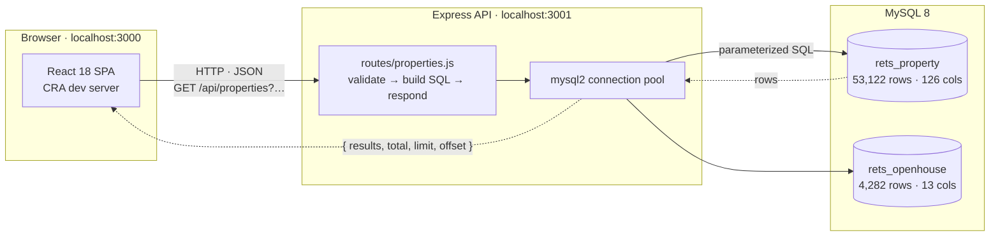
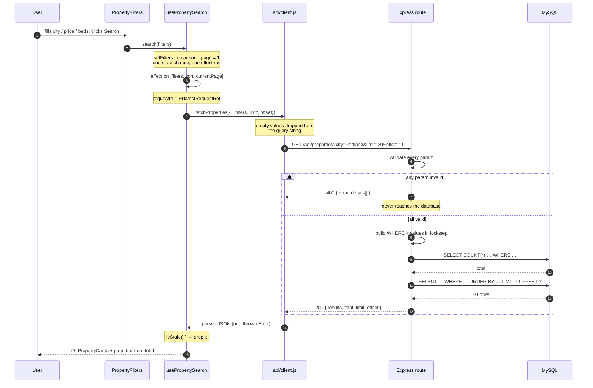
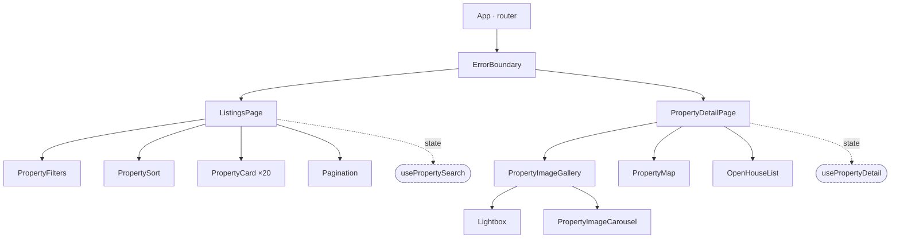
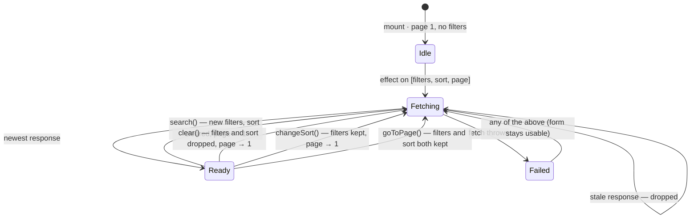
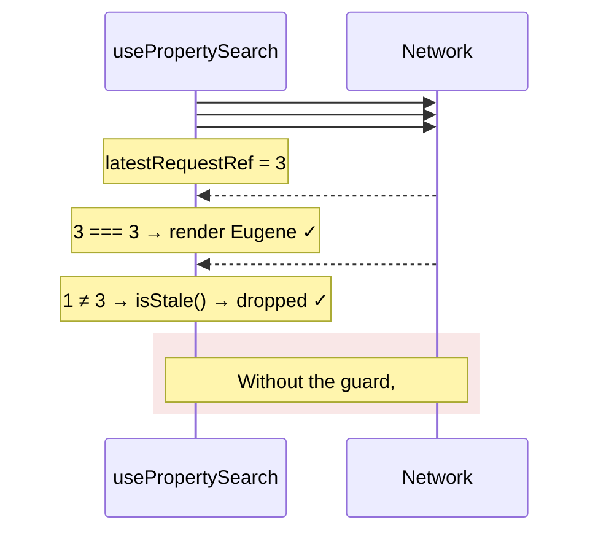
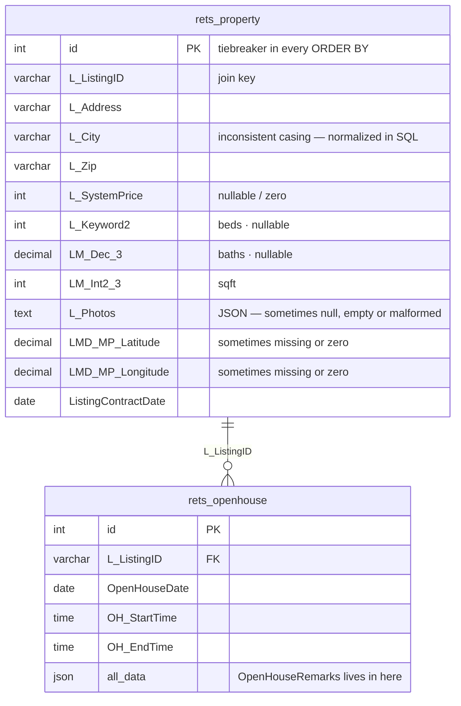

# IDX Exchange — Architecture

Diagrams for the Week 12 presentation. The Mermaid blocks render on GitHub;
the ASCII version in [`presentation.md`](presentation.md) is the one to copy
onto a whiteboard.

- [System overview](#system-overview)
- [Request lifecycle: search → results](#request-lifecycle-search--results)
- [Frontend component tree](#frontend-component-tree)
- [State ownership on the listings page](#state-ownership-on-the-listings-page)
- [Out-of-order responses, and the guard](#out-of-order-responses-and-the-guard)
- [Data model](#data-model)

---

## System overview

Three tiers, one direction of dependency. The browser never talks to MySQL, and
the API holds no session state — every request carries everything it needs.

**Endpoints**

| Method | Path | Returns |
|---|---|---|
| `GET` | `/api/health` | liveness |
| `GET` | `/api/properties` | one page of results + total count |
| `GET` | `/api/properties/:id` | one property |
| `GET` | `/api/properties/:id/openhouses` | that property's open houses |

---

## Request lifecycle: search → results

The hop-by-hop version of the whiteboard drawing. Note where the request
**stops early**: an invalid parameter never reaches the database.

---

## Frontend component tree

Both pages are rendering only — the dashed nodes are the custom hooks that own
the fetching and the state.

---

## State ownership on the listings page

Filters, sort and page are one unit because they reset each other. Every arrow
below is a reset rule that would otherwise have to live in the component.

**The rule to say out loud:** anything that changes *which* rows match returns
to page 1; only `goToPage` doesn't. Page 3 of the old result set may not exist
in the new one.

---

## Out-of-order responses, and the guard

The bug from Week 6, as a picture. Requests are sent in order; responses are
not.

`ListingsPage.test.js` resolves deferred promises in exactly this order;
removing the `isStale()` guards makes it fail.

---

## Data model

### Indexes that matter

| Index | Columns | What it serves |
|---|---|---|
| `idx_city_price` | `(LOWER(TRIM(L_City)), L_SystemPrice)` | city filter + price range + the ORDER BY. **Functional** — a plain index on `L_City` is unusable once the query wraps it in `LOWER(TRIM())`. |
| `idx_L_SystemPrice` | `(L_SystemPrice)` → physically `(L_SystemPrice, id)` | price-only sorts. InnoDB appends the PK, which is why the tiebreaker must follow the sort direction. |

`EXPLAIN` on the city+price query: `type: ALL`, `key: NULL`,
`Using where; Using filesort`, 53,122 rows, **557 ms** → after the index,
116 rows examined, no filesort, **4.3 ms**.

### The data problems the code has to absorb

| Where | Problem | Handled by |
|---|---|---|
| `L_City` | `portland` / `Portland` / `PORTLAND` | `LOWER(TRIM())` on both sides + functional index |
| `L_Photos` | null, empty string, or malformed JSON | `utils/photos.js`, parse in `try/catch` → empty gallery |
| lat/lon | missing or zero | `PropertyMap` renders conditionally |
| `L_SystemPrice` | null or zero | `utils/format.js` → "Price unavailable" rather than `$0` |
| `L_Keyword2` / `LM_Dec_3` | null | omitted rather than rendered as `null beds` |
| `OpenHouseRemarks` | not a column — nested in `all_data` | `utils/openHouse.js::parseOpenHouseRemarks` |
| `sortBy` | RESO names silently return unsorted rows | whitelist of real SQL column names → `400` |
